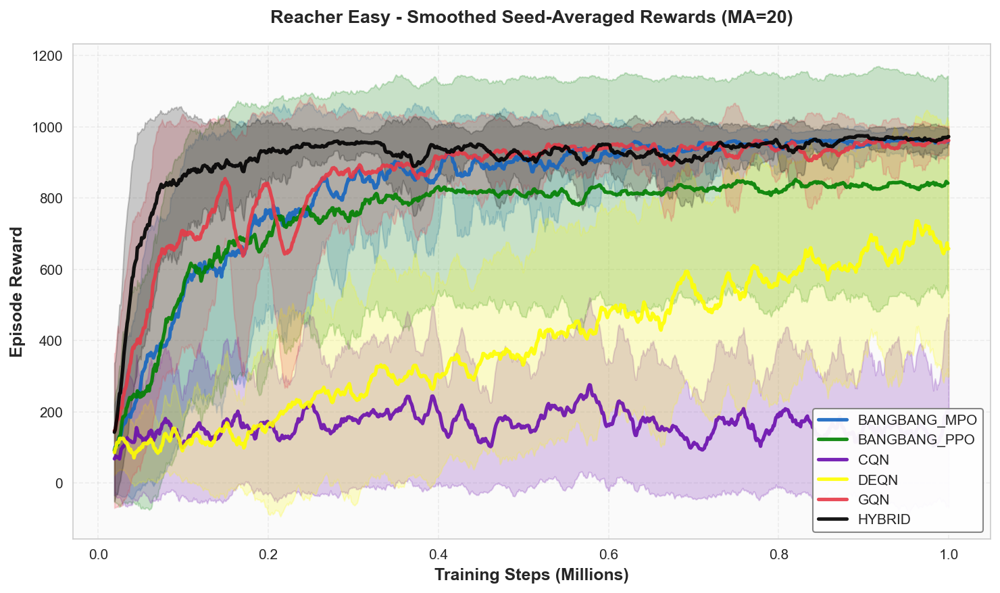
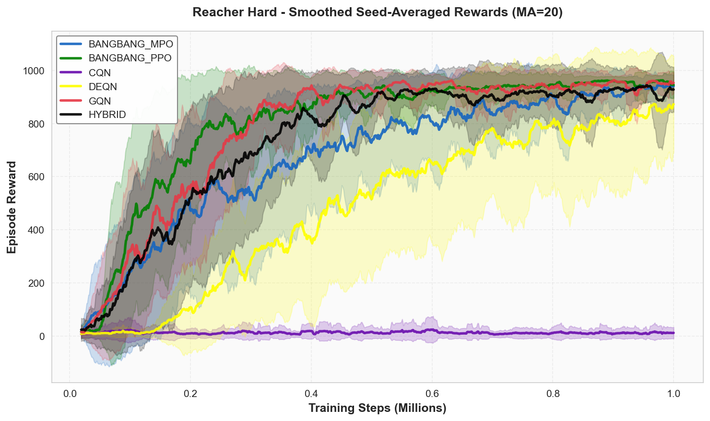
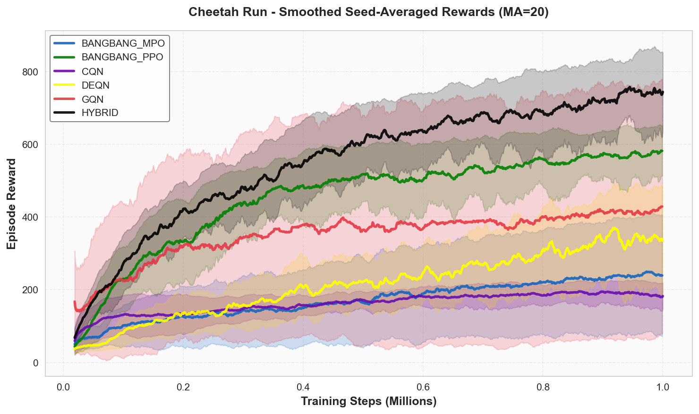
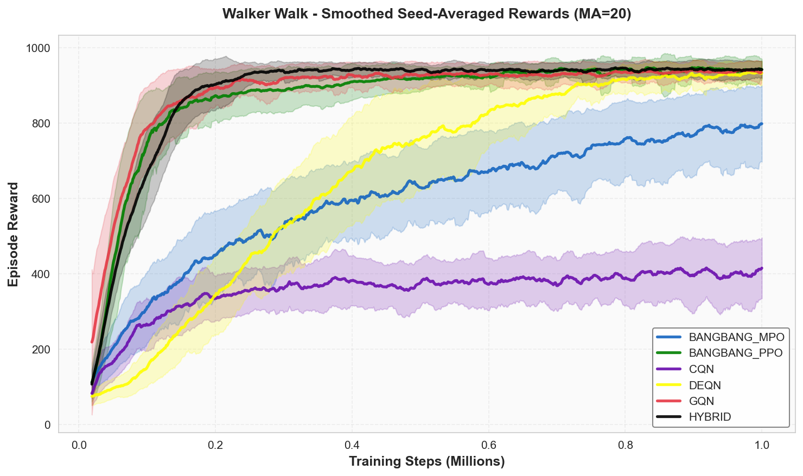
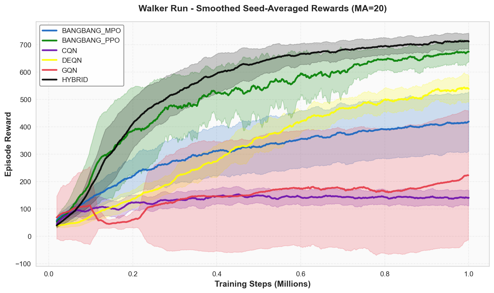
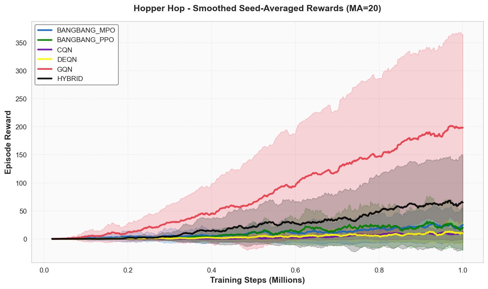
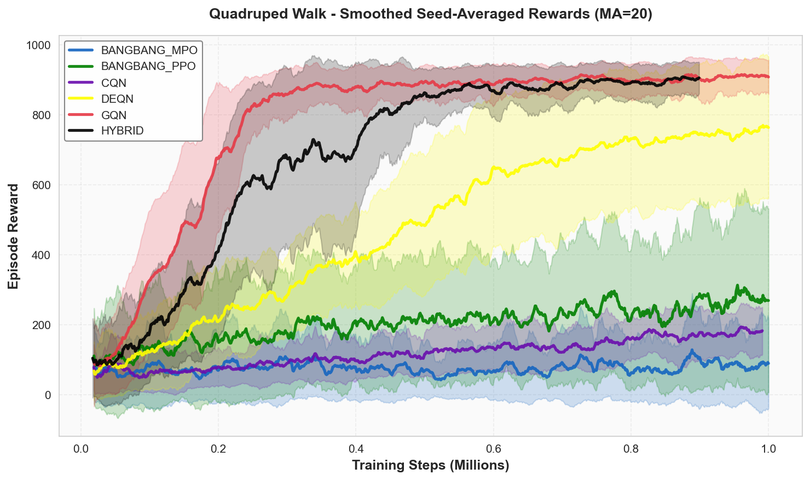
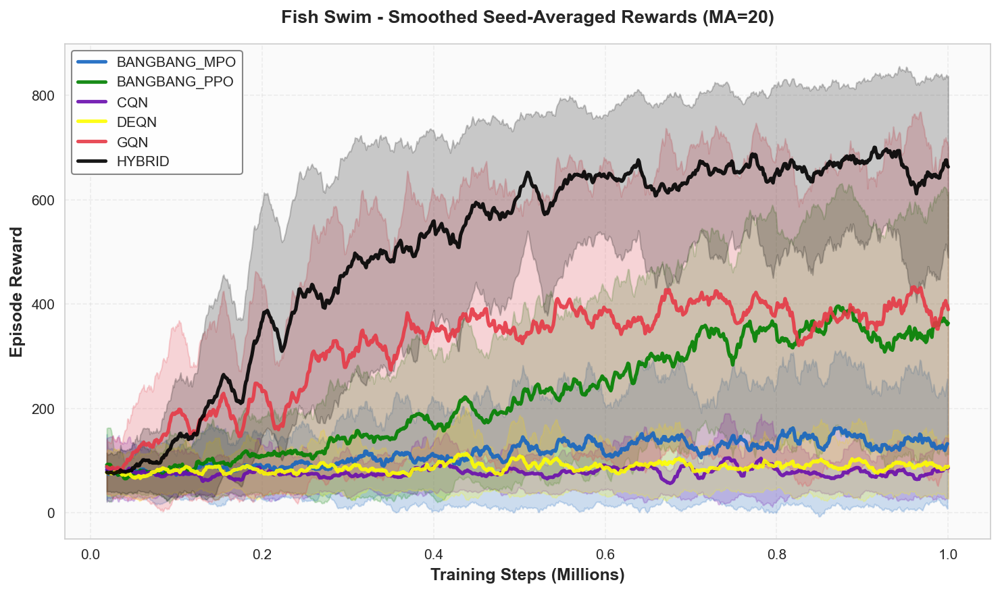

# Discrete Q-Learning Approaches to Continuous Control

[](https://www.python.org/downloads/release/python-3120/)
[](https://pytorch.org/)
[](https://opensource.org/licenses/MIT)

> **Master's Project**: Investigating Q-learning approaches for continuous control through intelligent action space discretization

This repository contains the complete implementation and experimental evaluation of four distinct Q-learning methods for continuous control: **Bang-Bang Control with Bernoulli Policies**, **Decoupled Q-Networks (DecQN)**, **Growing Q-Networks (GQN)**, and **Coarse-to-Fine Q-Networks (CQN)**. Our research demonstrates that appropriately designed value-based methods can match or exceed actor-critic performance while offering advantages in sample efficiency, stability, and computational tractability.

## 📚 Table of Contents

- [Key Findings](#-key-findings)
- [Project Structure](#-project-structure)
- [Installation](#-installation)
- [Quick Start](#-quick-start)
- [Implemented Methods](#-implemented-methods)
- [Experimental Results](#-experimental-results)
- [Usage Examples](#-usage-examples)
- [Supported Environments](#-supported-environments)
- [Citation](#-citation)
- [Acknowledgments](#-acknowledgments)

## 🔬 Key Findings

### Task-Dependent Discretization Strategies

Our experiments reveal a fundamental insight: **optimal discretization strategies depend on task complexity**.

- **Simple Tasks** (Walker Walk, Hopper Hop): Coarse uniform discretization (2-3 bins) enables rapid convergence
  - DecQN achieved **800+ reward within 200K steps** on Walker Walk
  - Bang-Bang control validates Pontryagin's Maximum Principle predictions
  
- **Complex Tasks** (Fish Swim, Quadruped Walk): Finer discretization or adaptive resolution required
  - Fine discretization (5-9 bins) necessary for smooth coordinated control
  - Adaptive methods (GQN) automatically adjust to task demands

### Performance Summary

| Method | Walker Walk | Fish Swim | Quadruped (12D) | Sample Efficiency |
|--------|-------------|-----------|-----------------|-------------------|
| **DecQN** | ⭐ 800+ | ⭐ 700+ | ⭐ 800+ | ⭐⭐⭐⭐⭐ |
| **GQN** | ⭐ 750+ | ⭐ 700+ | ⭐ 750+ | ⭐⭐⭐⭐⭐ |
| **Bang-Bang PPO** | ⭐ 600+ | 500+ | 600+ | ⭐⭐⭐⭐ |
| **CQN** | 500+ | 500+ | 300+ | ⭐⭐⭐ |

**Key Advantage**: DecQN with 12 dimensions requires only **24 Q-value evaluations** vs. **4096 for joint discretization** (~170× speedup)

## 📁 Project Structure

```
Masters_Project/
├── src/
│   ├── bangbang/          # Bang-Bang Control (PPO, SAC, MPO)
│   │   ├── agent.py       # BangBangAgent implementation
│   │   ├── algorithms.py  # PPO, SAC, MPO implementations
│   │   ├── bernoulli_policy.py
│   │   └── train.py
│   │
│   ├── deqn/             # Decoupled Q-Networks
│   │   ├── agent.py      # DecQNAgent with value decomposition
│   │   ├── critic.py     # Dual Q-network architecture
│   │   ├── discretizer.py
│   │   ├── config.py
│   │   └── train.py
│   │
│   ├── gqn/              # Growing Q-Networks
│   │   ├── agent.py      # GQNAgent with progressive refinement
│   │   ├── action_space_manager.py  # Growth scheduling
│   │   ├── scheduler.py  # Linear/adaptive growth
│   │   ├── network.py
│   │   ├── config.py
│   │   └── train.py
│   │
│   ├── cqn/              # Coarse-to-Fine Q-Networks
│   │   ├── agent.py      # CQNAgent with hierarchical selection
│   │   ├── critic.py     # Multi-level Q-functions
│   │   ├── encoder.py    # Vision encoder for pixels
│   │   ├── networks.py
│   │   ├── train_dmc.py
│   │   └── replay_buffer_dmc.py
│   │
│   ├── gcqn/             # Experimental: GCQN (weighted selection)
│   │   ├── agent.py
│   │   ├── action_space_manager.py
│   │   └── train.py
│   │
│   └── common/           # Shared utilities
│       ├── actors.py
│       ├── checkpoint_manager.py
│       ├── encoder.py
│       ├── env_factory.py
│       ├── logger.py
│       ├── metrics_tracker.py
│       ├── networks.py
│       ├── replay_buffer.py
│       └── training_utils.py
│
├── Project/               # LaTeX project source
│   ├── chapters/
│   │   ├── 1-introduction.tex
│   │   ├── 2-relatedwork.tex
│   │   ├── 3-background.tex
│   │   ├── 4-approach.tex
│   │   ├── 5-experiments.tex
│   │   └── 6-conclusion.tex
│   └── main.tex
│
├── configs/              # Configuration files
├── scripts/              # Training scripts
├── requirements.txt
└── README.md
```

## 🚀 Installation

### Prerequisites

- Python 3.12+
- CUDA 11.8+ (for GPU acceleration)
- MuJoCo 2.1+ (for physics simulation)

### Setup

```bash
# Clone the repository
git clone https://github.com/yourusername/Masters_Project.git
cd Masters_Project

# Create virtual environment
conda create -n discrete_rl python=3.12
conda activate discrete_rl

# Install PyTorch (with CUDA)
pip install torch torchvision torchaudio --index-url https://download.pytorch.org/whl/cu118

# Install MuJoCo
pip install mujoco

# Install dm_control
pip install dm_control

# Install other dependencies
pip install -r requirements.txt
```

### Requirements

```txt
# Core dependencies
torch>=2.0.0
numpy>=1.24.0
dm_control>=1.0.0
mujoco>=2.3.0

# Optional dependencies
metaworld>=2.0.0        # For MetaWorld benchmarks
ogbench>=0.1.0          # For OGBench environments

# Utilities
matplotlib>=3.7.0
seaborn>=0.12.0
pandas>=2.0.0
tensorboard>=2.13.0
wandb>=0.15.0           # Optional: for experiment tracking
```

## 🏃 Quick Start

### 1. Train DecQN (Recommended Starting Point)

```bash
# Train on Walker Walk with default settings
python -m src.deqn.train \
    --task walker_walk \
    --num-episodes 1000 \
    --num-bins 2 \
    --seed 0

# Train on complex task with finer discretization
python -m src.deqn.train \
    --task fish_swim \
    --num-bins 9 \
    --learning-rate 1e-4 \
    --batch-size 256
```

### 2. Train GQN (Adaptive Resolution)

```bash
# Adaptive growth schedule (recommended)
python -m src.gqn.train \
    --task walker_walk \
    --initial-bins 2 \
    --final-bins 9 \
    --growing-schedule adaptive \
    --num-episodes 1000

# Linear growth schedule
python -m src.gqn.train \
    --task quadruped_walk \
    --initial-bins 2 \
    --final-bins 9 \
    --growing-schedule linear
```

### 3. Train Bang-Bang Control

```bash
# Bang-Bang with PPO
python -m src.bangbang.train \
    --task walker_walk \
    --algorithm ppo \
    --num-episodes 1000

# Bang-Bang with SAC
python -m src.bangbang.train \
    --task hopper_hop \
    --algorithm sac
```

### 4. Train CQN (Hierarchical)

```bash
# CQN with 3 levels, 5 bins per level
python -m src.cqn.train_dmc \
    --task-name walker_walk \
    --levels 3 \
    --bins 5 \
    --num-train-steps 1000000
```

## 🎯 Implemented Methods

### 1. Decoupled Q-Networks (DecQN)

**Best for**: General-purpose continuous control, high-dimensional tasks

```python
from src.deqn.agent import DecQNAgent
from src.deqn.config import create_config_from_args

# Value decomposition: Q(s,a) = (1/d) Σ Q_i(s, a_i)
agent = DecQNAgent(config, obs_shape, action_spec)
```

**Key Features**:
- Linear complexity: O(d × n) vs O(n^d) for joint discretization
- IGM principle for exact greedy selection
- Double Q-learning with prioritized replay
- Scales to 12+ dimensions

**Paper**: [Solving Continuous Control via Q-learning](https://arxiv.org/abs/2210.12566) (Seyde et al., 2022)

### 2. Growing Q-Networks (GQN)

**Best for**: Unknown task complexity, heterogeneous precision requirements

```python
from src.gqn.agent import GQNAgent

# Progressive refinement: 2 → 3 → 5 → 9 bins
agent = GQNAgent(config, obs_shape, action_spec)
agent.check_and_grow(episode, episode_return)
```

**Key Features**:
- Curriculum learning in action space
- Adaptive or linear growth schedules
- Warm-start initialization across growth stages
- Automatic resolution allocation per dimension

**Paper**: [Growing Q-Networks](https://arxiv.org/abs/2404.09253) (Seyde et al., 2024)

### 3. Bang-Bang Control with Bernoulli Policies

**Best for**: Minimum-time problems, simple locomotion

```python
from src.bangbang.agent import BangBangAgent

# Binary discretization: a_i ∈ {a_min, a_max}
agent = BangBangAgent(args, obs_shape, action_spec)
```

**Key Features**:
- Extreme simplification (2^d actions)
- Compatible with PPO, SAC, MPO
- Theoretical grounding in optimal control
- Fastest convergence on simple tasks

**Paper**: [Is Bang-Bang Control All You Need?](https://arxiv.org/abs/2111.02552) (Seyde et al., 2021)

### 4. Coarse-to-Fine Q-Networks (CQN)

**Best for**: Low-dimensional tasks with demonstrations, precise control

```python
from src.cqn.agent import CQNAgent

# Hierarchical: L levels × B bins = B^L effective precision
agent = CQNAgent(
    rgb_obs_shape, low_dim_obs_shape, action_shape,
    levels=3, bins=5, atoms=51  # Distributional RL
)
```

**Key Features**:
- Iterative zooming: log(B^L) evaluations
- Distributional Q-learning (C51)
- Behavioral cloning integration
- Multi-view vision encoder support

**Paper**: [Continuous Control with Coarse-to-fine RL](https://arxiv.org/abs/2407.07787) (Seo et al., 2024)

### 5. GCQN (Experimental)

**Best for**: Research on adaptive weighted selection

```python
from src.gcqn.agent import GCQNAgent

# Q-value guided growth with lazy pruning
agent = GCQNAgent(config, obs_shape, action_spec)
```

**Key Features**:
- Weighted bin selection: P(bin) ∝ exp(Q/T)
- Lazy pruning (preserves exploration)
- Temperature-based softmax transitions
- Dimension-specific resolution

## 📊 Experimental Results

### Learning Curve Plots

Pre-generated learning curves comparing all methods are available in [`src/plotting/output/plots/`](src/plotting/output/plots/). Each plot shows mean episode return with shaded ±1 standard deviation across 7 random seeds over 1M environment steps.

> **Note:** Plots are stored as PDFs. To embed them below, export to PNG first:
> ```bash
> cd src/plotting/output/plots
> for f in *.pdf; do convert -density 150 "$f" "${f%.pdf}.png"; done
> ```

<table>
  <tr>
    <td align="center">
      <br/>
      <sub><b>Reacher Easy</b> (2 DoF)</sub>
    </td>
    <td align="center">
      <br/>
      <sub><b>Reacher Hard</b> (2 DoF)</sub>
    </td>
    <td align="center">
      <br/>
      <sub><b>Cheetah Run</b> (6 DoF)</sub>
    </td>
  </tr>
  <tr>
    <td align="center">
      <br/>
      <sub><b>Walker Walk</b> (6 DoF)</sub>
    </td>
    <td align="center">
      <br/>
      <sub><b>Walker Run</b> (6 DoF)</sub>
    </td>
    <td align="center">
      <br/>
      <sub><b>Hopper Hop</b> (4 DoF)</sub>
    </td>
  </tr>
  <tr>
    <td align="center">
      <br/>
      <sub><b>Quadruped Walk</b> (12 DoF)</sub>
    </td>
    <td align="center">
      <br/>
      <sub><b>Fish Swim</b> (5 DoF)</sub>
    </td>
    <td align="center">
      &nbsp;
    </td>
  </tr>
</table>

### Generating Plots

Plots are generated by `src/plotting/plot_results.py`, which reads saved metrics from `src/plotting/metrics/` and writes PDFs to `src/plotting/output/plots/`:

```bash
# Generate all plots from saved metrics
python src/plotting/plot_results.py

# Test plotting utilities
python src/plotting/metrics_tester.py
```

The `src/plotting/plotting_utils.py` module contains the `PlottingUtils` class used by all trainers to produce consistent figures:

```python
from src.plotting.plotting_utils import PlottingUtils

plotter = PlottingUtils(logger, metrics_tracker, save_dir="src/plotting/output/plots")
plotter.plot_training_curves(save=True)
plotter.plot_reward_distribution(save=True)
plotter.print_summary_stats()
```

### Computational Complexity

| Task | Action Dim | Joint Space | Decoupled | Speedup |
|------|-----------|-------------|-----------|---------|
| Reacher | 2 | 4 | 4 | 1× |
| Walker | 6 | 64 | 12 | 5.3× |
| Quadruped | 12 | 4,096 | 24 | **170×** |
| Fish | 5 | 32 | 10 | 3.2× |

## 💡 Usage Examples

### Complete Training Pipeline

```python
import torch
from src.deqn.agent import DecQNAgent
from src.deqn.config import create_config_from_args
from src.common.training_utils import get_env, process_observation

# Setup
config = create_config_from_args(args)
env = get_env(config.task, logger, config.seed)
agent = DecQNAgent(config, obs_shape, action_spec)

# Training loop
for episode in range(config.num_episodes):
    obs = env.reset()
    episode_reward = 0
    
    while not done:
        # Select action
        action = agent.select_action(obs, evaluate=False)
        
        # Environment step
        next_obs, reward, done = env.step(action)
        
        # Store transition
        agent.observe(action, reward, next_obs, done)
        
        # Update networks
        if len(agent.replay_buffer) > config.min_replay_size:
            metrics = agent.update()
        
        obs = next_obs
        episode_reward += reward
    
    # Save checkpoint
    if episode % 100 == 0:
        agent.save_checkpoint(f"checkpoint_{episode}.pth", episode)
```

### Custom Discretization

```python
from src.deqn.discretizer import Discretizer

# Create custom discretizer
discretizer = Discretizer(
    action_spec={
        "low": [-1.0, -1.0, -1.0],
        "high": [1.0, 1.0, 1.0]
    },
    num_bins=5,  # 5 bins per dimension
    decouple=True  # Use value decomposition
)

# Convert between continuous and discrete
continuous_action = torch.tensor([[0.5, -0.3, 0.8]])
discrete_action = discretizer.continuous_to_discrete(continuous_action)
reconstructed = discretizer.discrete_to_continuous(discrete_action)
```

### Custom Growth Schedule

```python
from src.gqn.scheduler import GrowthScheduler

# Adaptive scheduler (performance-based)
scheduler = GrowthScheduler(
    schedule_type="adaptive",
    num_episodes=1000,
    num_growth_stages=4
)

# Check if should grow
should_grow = scheduler.should_grow(episode=150, current_return=750)

# Linear scheduler (episode-based)
scheduler = GrowthScheduler(
    schedule_type="linear",
    num_episodes=1000,
    num_growth_stages=4
)
# Grows at episodes: [250, 500, 750]
```

### Load and Evaluate

```python
# Load trained agent
checkpoint = torch.load("checkpoint_final.pth")
agent.load_checkpoint("checkpoint_final.pth")

# Evaluate
eval_rewards = []
for _ in range(10):
    obs = env.reset()
    episode_reward = 0
    done = False
    
    while not done:
        action = agent.select_action(obs, evaluate=True)  # No exploration
        obs, reward, done = env.step(action)
        episode_reward += reward
    
    eval_rewards.append(episode_reward)

print(f"Mean reward: {np.mean(eval_rewards):.2f} ± {np.std(eval_rewards):.2f}")
```

## 🎮 Supported Environments

### DeepMind Control Suite (Primary Benchmark)

```python
# Available tasks
tasks = [
    "walker_walk",      # Bipedal locomotion (6 DoF)
    "walker_run",       # High-velocity locomotion
    "hopper_hop",       # Single-leg hopping (4 DoF)
    "cheetah_run",      # Quadruped running (6 DoF)
    "quadruped_walk",   # Four-legged walking (12 DoF)
    "fish_swim",        # Undulating swimming (5 DoF)
    "reacher_easy",     # 2D reaching (2 DoF)
    "reacher_hard",     # Precise reaching (2 DoF)
]

# Usage
from dm_control import suite
env = suite.load(domain_name="walker", task_name="walk")
```

### MetaWorld (Optional)

```bash
pip install metaworld

# Train on MetaWorld tasks
python -m src.gqn.train \
    --env-type metaworld \
    --task reach-v3 \
    --num-episodes 1000
```

### OGBench (Optional)

```bash
pip install ogbench

# Train on OGBench tasks
python -m src.gqn.train \
    --env-type ogbench \
    --task antmaze-large-navigate-v0 \
    --ogbench-dataset-dir ~/.ogbench/data
```

## 🔧 Configuration

### Hyperparameters

**DecQN** (best for most tasks):
```yaml
learning_rate: 1e-4
batch_size: 256
num_bins: 2          # Start coarse for simple tasks
target_update: 100   # Target network sync frequency
epsilon: 0.1         # Exploration rate
discount: 0.99
n_step: 3            # N-step returns
per_alpha: 0.6       # Prioritized replay
```

**GQN** (adaptive resolution):
```yaml
initial_bins: 2
final_bins: 9
growing_schedule: "adaptive"  # or "linear"
min_episodes_between_growth: 50
learning_rate: 1e-4
```

**Bang-Bang PPO**:
```yaml
learning_rate: 3e-4
clip_ratio: 0.2
ppo_epochs: 10
batch_size: 2048
gae_lambda: 0.95
```

### Environment-Specific Recommendations

| Task | Recommended Method | Num Bins | Notes |
|------|-------------------|----------|-------|
| Walker Walk | DecQN / GQN | 2-3 | Simple locomotion |
| Hopper Hop | Bang-Bang PPO | 2 | Bang-bang optimal |
| Fish Swim | DecQN | 5-9 | Needs smooth control |
| Quadruped Walk | DecQN / GQN | 2-3 | High dimensional |
| Reacher Easy | Any | 2-5 | Low dimensional |
| Humanoid | DecQN | 5-9 | Very complex |

## 📈 Monitoring Training

### TensorBoard

```bash
# Start TensorBoard
tensorboard --logdir=output/logs

# Training metrics logged:
# - Episode reward
# - Q-value estimates
# - TD error
# - Loss values
# - Epsilon decay
# - Growth events (GQN)
```

### Weights & Biases (Optional)

```bash
# Install wandb
pip install wandb

# Login
wandb login

# Enable in training
python -m src.deqn.train \
    --task walker_walk \
    --use-wandb \
    --wandb-project "discrete-rl" \
    --wandb-entity "your-entity"
```

### Checkpoints

Checkpoints are automatically saved to `output/{method}/checkpoints/`:

```
checkpoints/
├── walker_walk_0_100.pth      # task_seed_episode
├── walker_walk_0_500.pth
├── walker_walk_0_1000.pth
└── walker_walk_0_final.pth
```

Load checkpoint:
```python
agent.load_checkpoint("output/deqn/checkpoints/walker_walk_0_final.pth")
```

## 🧪 Running Experiments

### Reproduce Paper Results

```bash
# Run all DecQN experiments
bash scripts/run_deqn_suite.sh

# Run GQN ablation studies
bash scripts/run_gqn_ablation.sh

# Compare all methods on Walker Walk
bash scripts/compare_methods.sh walker_walk
```

### Ablation Studies

```bash
# Test different bin counts (DecQN)
for bins in 2 3 5 9; do
    python -m src.deqn.train \
        --task walker_walk \
        --num-bins $bins \
        --seed 0
done

# Test growth schedules (GQN)
for schedule in linear adaptive; do
    python -m src.gqn.train \
        --task fish_swim \
        --growing-schedule $schedule \
        --seed 0
done
```

### Multi-Seed Evaluation

```bash
# Run with multiple seeds for statistical significance
for seed in 0 1 2 3 4 5 6; do
    python -m src.deqn.train \
        --task walker_walk \
        --seed $seed \
        --num-episodes 1000
done

# Aggregate results
python scripts/aggregate_results.py \
    --method deqn \
    --task walker_walk \
    --num-seeds 7
```

## 🐛 Troubleshooting

### Common Issues

**1. CUDA Out of Memory**
```bash
# Reduce batch size
--batch-size 128

# Reduce replay buffer size
--max-replay-size 500000

# Use CPU
--device cpu
```

**2. MuJoCo Rendering Issues**
```bash
# Set rendering backend
export MUJOCO_GL=osmesa  # For headless servers
export MUJOCO_GL=egl     # For GPU rendering
```

**3. Slow Training**
```bash
# Check GPU utilization
nvidia-smi

# Enable mixed precision (experimental)
--use-amp

# Reduce target network update frequency
--target-update-period 200
```

**4. Poor Performance**

- Check exploration: Ensure epsilon > 0 early in training
- Verify replay buffer size: Should be >> min_replay_size
- Try different learning rates: [1e-5, 3e-5, 1e-4, 3e-4]
- Increase discretization for complex tasks: num_bins >= 5

## 📝 Citation

If you use this code in your research, please cite:

```bibtex
@mastersproject{nooranbakht2025discrete,
  title={Discrete Q-Learning Approaches to Continuous Control},
  author={Nooranbakht, Parham},
  year={2025},
  school={Albert-Ludwigs-University Freiburg},
  type={Master's Project}
}
```

### Referenced Papers

```bibtex
@article{seyde2022solving,
  title={Solving Continuous Control via Q-learning},
  author={Seyde, Tim and Werner, Jochen and Schwarting, Wilko and others},
  journal={arXiv preprint arXiv:2210.12566},
  year={2022}
}

@article{seyde2024growing,
  title={Growing Q-Networks: Solving Continuous Control Tasks with Adaptive Control Resolution},
  author={Seyde, Tim and Schwarting, Wilko and Gilitschenski, Igor and others},
  journal={arXiv preprint arXiv:2404.09253},
  year={2024}
}

@inproceedings{seyde2021bangbang,
  title={Is Bang-Bang Control All You Need? Solving Continuous Control with Bernoulli Policies},
  author={Seyde, Tim and Gilitschenski, Igor and Schwarting, Wilko and others},
  booktitle={Advances in Neural Information Processing Systems},
  year={2021}
}

@inproceedings{seo2024continuous,
  title={Continuous Control with Coarse-to-fine Reinforcement Learning},
  author={Seo, Younggyo and Liu, Jafar and James, Stephen},
  booktitle={International Conference on Learning Representations},
  year={2024}
}
```

## 🤝 Contributing

Contributions are welcome! Please follow these guidelines:

1. **Fork the repository**
2. **Create a feature branch**: `git checkout -b feature/new-method`
3. **Follow code style**: Clean code principles, type hints, docstrings
4. **Add tests**: Ensure new features are tested
5. **Update documentation**: README and code comments
6. **Submit pull request**: With clear description

### Code Style

- Use type hints for function signatures
- Write docstrings for classes and functions
- Follow clean code principles (small functions, single responsibility)
- No hashtag comments; use docstrings instead
- Maximum line length: 88 characters (Black formatter)

## 📄 License

This project is licensed under the MIT License - see the [LICENSE](LICENSE) file for details.

## 👥 Authors

**Parham Nooranbakht**  
Master's Student, Computer Science  
Albert-Ludwigs-University Freiburg  
Email: parham.nooranbakht@students.uni-freiburg.de

**Supervisor**: Seyed Mahdi Basiri Azad (Erfan)  
**Examiner**: Prof. Dr. Joschka Bödecker

## 🙏 Acknowledgments

- **DeepMind** for the Control Suite benchmark
- **Tim Seyde et al.** for the DecQN, GQN, and Bang-Bang papers
- **Younggyo Seo et al.** for the CQN paper
- **RL Algorithms Research Group** at University of Freiburg
- All contributors to PyTorch, dm_control, and MuJoCo


---

**Keywords**: Reinforcement Learning, Q-Learning, Continuous Control, Action Discretization, Value Decomposition, DeepMind Control Suite, PyTorch

**Status**: ✅ Complete | 🔬 Active Research | 📊 Reproducible

For questions or issues, please open a GitHub issue or contact the author directly.